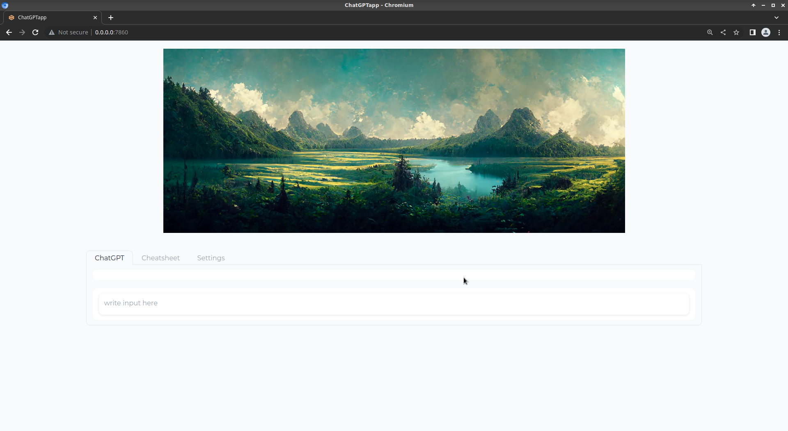
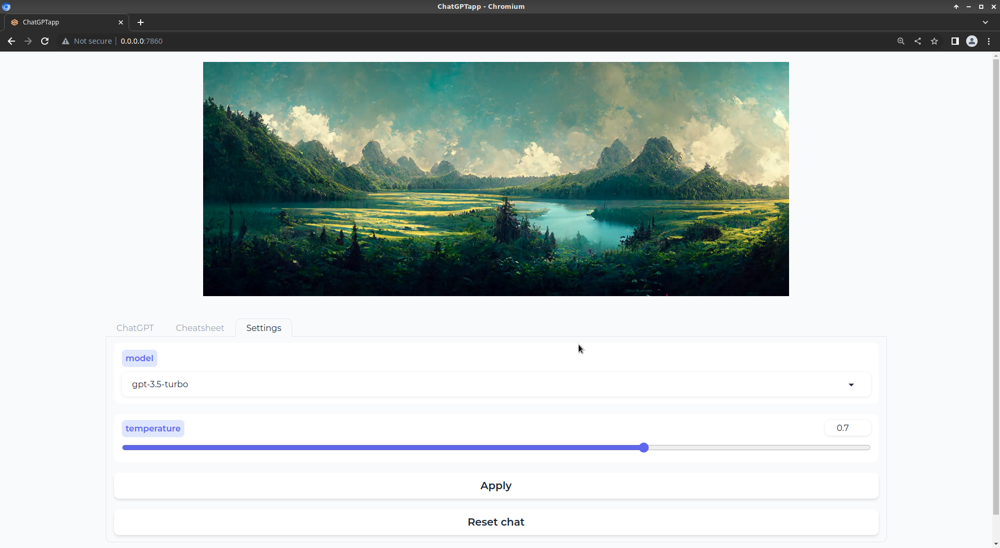

### Gradio app streaming prompt completion with OpenAI API

[](https://github.com/bkocis/gradio-apps/actions/workflows/python-app.yml)

---

## About

This is a simple web application that uses [Gradio](https://gradio.app/) to stream chat using OpenAI chatgpt API.
A docker container can be built and hosted on your own server, so you can have "almost" the same user experience with ChatGPT, as with the official site. 



Multiple tabs for accessing different models and settings



## Some Features

- [LangChain `ChatOpenAI`](https://python.langchain.com/en/latest/modules/models/chat/integrations/openai.html)
- Streaming
- [State management](https://gradio.app/state-in-blocks/) so multiple users can use it
- UI with [Gradio](https://gradio.app/)
- types and comments

## Installation

### OpenAI API Key

The api key is required to run the application. You can get it from [OpenAI](https://beta.openai.com/)

On local machine, you can put your api key in your `.bashrc` or `.zshrc` file, or add to the list of environment variables in your IDE.

```bash
export OPENAI_API_KEY=<YOUR_API_KEY>
```

When building the docker image, the api key is passed as a build argument. Make sure to have it to the instance where you build the image. 


### Getting started

Virtual enviroment
```bash
python -m venv .venv
source .venv/bin/activate
pip install -r requirements.txt
``` 

Running the application on local machine
```bash
cd chatgptApp
python main.py
```

### Docker 

Build and run docker container using commands from the Makefile

```bash
docker build --tag=${app_name} --build-arg OPENAI_API_KEY=${OPENAI_API_KEY} .
docker run -p ${port}:${port} ${app_name}
```

Deploy headless (target from Makefile)
```makefile
deploy_headless:
	docker build --tag=${app_name} --build-arg OPENAI_API_KEY=${OPENAI_API_KEY} .
	docker run -dit -p ${port}:${port} ${app_name}
```

Check the container with `docker logs`

### Nginx 

In case of deploying the app to your own server, you can use nginx for reverse proxy. Use the following endpoint block as a suggestion for the nginx config file:

```nginx
    location /chatgpt-app {
        proxy_pass http://0.0.0.0:8083;
        proxy_redirect off;
        proxy_http_version 1.1;
        proxy_set_header Upgrade $http_upgrade;
        proxy_set_header Connection "upgrade";
        proxy_set_header Host $host;
    }

```

Important to add the server_name, port, and root_path to the `demo.launch` method in `main.py`:

```python
demo.launch(
    server_name="0.0.0.0",
    server_port=8083,
    root_path="/openai-chatgpt-gradio-app")

```

---

Read more about deploying:
- [gradio apps to servers](https://gradio.app/running-gradio-on-your-web-server-with-nginx/)

Some issues encountered, with solution:

- [deploy gradio](https://discuss.huggingface.co/t/deploy-gradio-app-on-my-own-server-machine-fails/41808)

- [issue1747](https://github.com/gradio-app/gradio/issues/1747)

[Reference repo - kudos to FrancescoSaverioZuppichini](https://github.com/FrancescoSaverioZuppichini/gradioGPT) 👍
